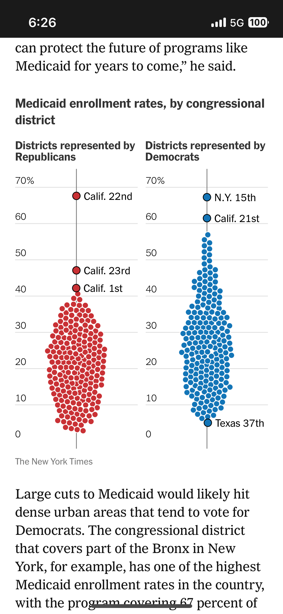
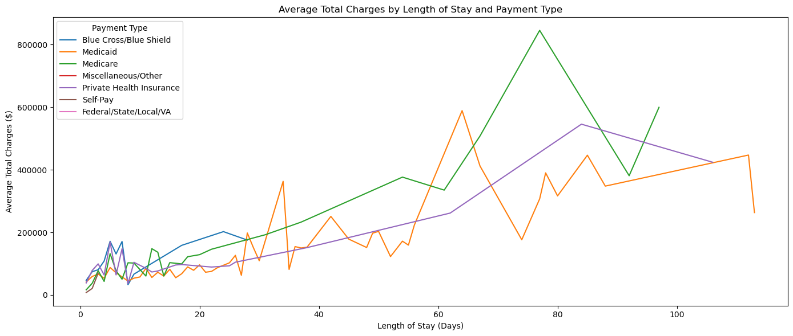
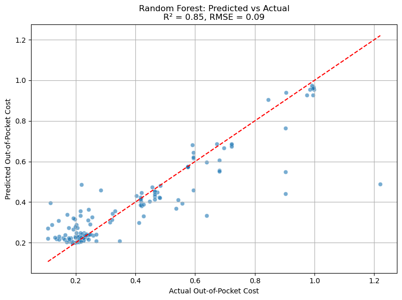
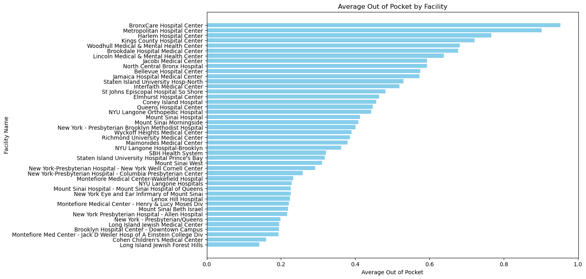
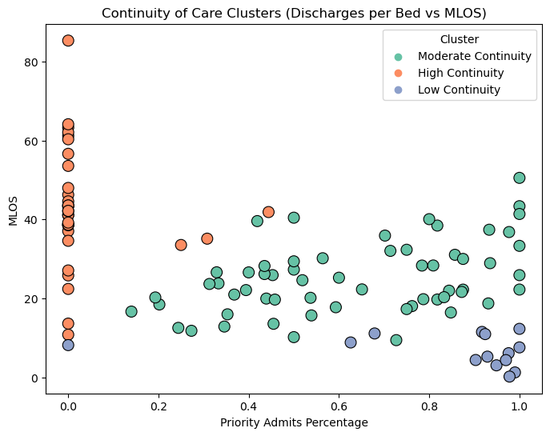

“

.png)
.png)

#### Barriers to  Housing

Supportive housing is intended to function at the nexus of housing and mental health care. Yet in practice, the connection between the two is often fragile—especially in neighborhoods like East New York, where decades of disinvestment have eroded the basic infrastructure needed to support either domain.
For many residents, mental health treatment does not begin until incarceration. Places like Rikers Island—now one of the largest psychiatric providers in the country—have become de facto sites of mental health care.Mental health impinges on incarceration, with treatment inextricably linked to the carceral system. After release, people are often discharged back into the same neighborhoods and structural inequities that precipitated their decline—areas with few clinics, overstretched providers, limited pharmacy access, and chronic housing instability. In East New York, this cycle is particularly visible. The lack of structural mental health care has created a void that law enforcement and the carceral system fills the void. In the absence of adequate treatment,  people struggling with mental illness are predisposed to drug addiction and engaging in criminal activity.

Lorenzo was discharged after overstaying the time limit and later rejected from  housing. Like many applicants, he was unable to prove chronic street homelessness. His rejection was likely compounded by his criminal record and the broad discretion granted to housing providers, many of whom avoid tenants perceived as high-risk.

The 2010e application process is highly selective, and research has shown that providers often engage in “creaming”—selecting applicants who appear less costly or easier to manage. Although Local Law 3 now requires New York City’s Human Resources Administration to release  housing application data (as of 2023), the dataset remains limited and opaque. Using this data, I created the following visualizations to highlight systemic barriers and provide a foundation for future monitoring as more detailed, annual data becomes available.

  <iframe src="https://willfainaru21.github.io/ConflictUrbanismFinal/sankey_diagramSH.html" style="width: 100%; height: 500px; border: none;"></iframe>

Local Law 3 also mandates that providers disclose the reasons for denying applicants. However, these justifications are often subjective and inconsistently recorded. Applicants are frequently rejected due to minor technicalities, incomplete documentation, or misinterpretations of eligibility criteria—particularly the vague and inconsistently applied definition of “chronically street homeless.”

  <iframe src="https://willfainaru21.github.io/ConflictUrbanismFinal/tree_diagramSH2.html" style="position:absolute;top:0;left:0;width:100%;height:100%;" frameborder="0"></iframe>

Despite being designed to foster stability and recovery,  housing often excludes people with criminal records. For instance, programs like NYC 15/15 disqualify applicants who were incarcerated for more than 90 days. Even those who do secure placements may find themselves warehoused in environments misaligned with their recovery needs, increasing the risk of recidivism. The pathway from incarceration to  housing is far less direct than the one available to individuals exiting a DHS-contracted shelter.

The following map illusrates how few  housing facilities within the New York State's Office of Mental Health facilites actually accepted applicants directly from correctional facilities. 

#### Continuity of Care using Machine Learning

Supportive housing is highly contingent on where it is located, as many facilities vary significantly across their retention rates, capacity constraints, and quality of services. The Office of Mental Health has organized Assertive Community Treatment Teams (ACT) to help clients navigate from institutions to supportive housing, through the Continuum of Care. But unfortunately, not all clients – particularly clients with criminal records – have access to these treatment teams. 
The following map displays the location of the Office of Mental Health’s supportive housing facilities and its ACT teams listed in its mental health directory. 
It is difficult to compare across supportive housing facilities as they vary significantly by location, populations they serve, financing sources, and performance. This makes it difficult to study continuity of care in regards to supportive housing. This is where I used K-Means Clustering to reclassify the OMH supportive housing facilities according to their performance metrics. This allowed be to delineate three clusters: High continuity, moderate continuity, and low continuity based on variables like “discharges per bed” and "median lengths of stay". By visualizing how these performance metrics vary across space, I could identify patterns that emerged between supportive housing and the mental health providers. It appears that ACT teams in close proximity to supportive housing sites in East Harlem and the South Bronx were more effective at transitioning patients to permanent supportive housing. 

#KMeans Clustering (N=3)

This map illustrates the spatial distribution of supportive housing facilities, highlighting variation across key indicators such as median length of stay, number of beds, and KMeans cluster scores—used here to assess relative program continuity. Also shown are the locations of Assertive Community Treatment (ACT) teams, mobile mental health clinics that assist clients transitioning from psychiatric institutions into supportive housing.

<iframe 
  src="https://willfainaru21.github.io/ConflictUrbanismFinal/supportive_housingmap.html" 
  style="width:100%; height:600px; border:none;">
</iframe>

#### Mental Health Care Disparities

Deterioration and disinvestment in the housing market often reverberate through the mental health care system. Housing insecurity amplifies psychological distress, while untreated mental illness can further destabilize housing—creating a self-reinforcing cycle of vulnerability. Bieler et al. describe housing and mental health care as interconnected elements within urban assemblages: interdependent constellations where precarity flows between systems (Bieler 2019). In this framework, instability and volatility in the housing market can permeate into the provision of public services.

  <iframe src="https://willfainaru21.github.io/ConflictUrbanismFinal/bivariate_layer_control_mapzoom.html"
    style="position:absolute;top:0;left:0;width:100%;height:100%;" frameborder="0">
  </iframe>

The following map explores the distribution of pharmacies across the city, with a particular focus on East New York—a neighborhood long recognized for its lack of infrastructure, adequate housing, and, notably, pharmacies. For individuals like Lorenzo, this gap in access can be devastating. He was off his prescribed medication at the time of his most recent arrest and has openly shared his struggles with substance abuse, an issue that has been prevalent in East New York since the 1990s. This map juxtaposes the geography of over-the-counter and prescription medication access with the street-level presence of controlled substances, unpackin the structural inequities that spur criminal actiity.

Research by Lim et al., using SPARCS data provided by the New York State Department of Health, shows that gentrification and displacement are associated with increased psychiatric hospitalizations across New York City (Lim 17).
Building on their work, I used the same SPARCS dataset to examine the financial burden of psychiatric care across neighborhoods. I queried 1,000 records of psychiatric discharges from hospitals in the New York City metro area, focusing on how much patients paid out of pocket compared to what their insurance covered.
Jamaica Hospital, where Lorenzo briefly received treatment, had one of the highest out-of-pocket ratios citywide. This indicates that patients there—many of whom are likely uninsured or underinsured—bear a disproportionately high share of psychiatric costs.

To examine the spatial dimension of this disparity, I overlaid hospital locations with demographic and housing data from the American Community Survey at the Neighborhood Tabulation Area (NTA) level. Key indicators included insurance coverage, housing cost burden, and access to care. This approach aims to visualize how neighborhood-level precarity not only shapes the financial burden of psychiatric treatment but also influences where patients are most likely to seek care.

By mapping hospitals alongside these indicators, I sought to better understand how systemic and structural disparities in health and housing manifest as unequal access to mental health services.

  <iframe 
    src="https://willfainaru21.github.io/ConflictUrbanismFinal/full_map_with_single_choropleth_toggle.html" 
    style="width:100%; height:100%; border:none;" 
    loading="lazy">
  </iframe>

#### Conclusion

In Root Shock, Mindy Thompson Fullilove argues that urban renewal and displacement become “hardwired in place,” leaving behind a lasting imprint on the physical and emotional fabric of neighborhoods. In the case of the client, this void—shaped by decades of disinvestment—manifested in his psychological unraveling and eventual entanglement with the carceral system. His story illustrates the deep, often invisible, connections between mental health, place, and the built environment.
Displacement and disinvestment do more than fragment neighborhoods—they disrupt the continuity of care and sever the social threads that bind communities together. They unravel what Baumann et. al calls the “life-space network”: the routines, relationships, and places that sustain a sense of stability and identity. When these networks collapse, people with mental illness often find themselves tethered not to community, but to institutions—prisons, hospitals, or shelters—that serve as inadequate substitutes for care.

Citations:

Bieler, Patrick, and Martina Klausner. "Niching in cities under pressure. Tracing the reconfiguration of community psychiatric care and the housing market in Berlin." Geoforum 101 (2019): 202-211.

Fullilove, Mindy Thompson. Root shock: How tearing up city neighborhoods hurts America, and what we can do about it. New Village Press, 2016.

HALE, CHARLES R., ed. Engaging Contradictions: Theory, Politics, and Methods of Activist Scholarship. 1st ed. University of California Press, 2008. http://www.jstor.org/stable/10.1525/j.ctt1pncnt.

Horn, Stacy. The Killing Fields of East New York: The First Subprime Mortgage Scandal, a White-Collar Crime Spree, and the Collapse of an American Neighborhood. New York: Gillian Flynn Books, an imprint of Zando, 2025.

Lim, Sungwoo, Pui Ying Chan, Sarah Walters, Gretchen Culp, Mary Huynh, and L. Hannah Gould. "Impact of residential displacement on healthcare access and mental health among original residents of gentrifying neighborhoods in New York City." PloS one 12, no. 12 (2017): e0190139.

Watnik, Ilissa L. "A constitutional analysis of Kendra's law: New York's solution for treatment of the chronically mentally ill." University of Pennsylvania Law Review 149, no. 4 (2001): 1181-1228.

Whitford, Emma. “‘A Lot of False Hope’: City Data Show Ongoing Barriers to Supportive Housing.” City Limits, September 20, 2023. https://citylimits.org/a-lot-of-false-hope-city-data-show-ongoing-barriers-to-supportive-housing/.

### Data Sources:

- New York State Office of Mental Health (Supportive Housing Performance Metrics 2023)  
- New York State Office of Mental Health (Assertive Community Treatment Data) 2023  
- New York State Department of Health Statewide Planning and Research Division (SPARCS) 2023  
- NYPD Incident Level Data 2024  
- Open Street Map Open API  
- American Community Survey (Economic and Housing Data) 2022  
- NYC Human Resources Administration (HRA) Application data for fiscal year June 2022–July 2023 (Client's application cycle)  
- NYC Department of Finance: Properties in Tax Lien (2017–2021)

